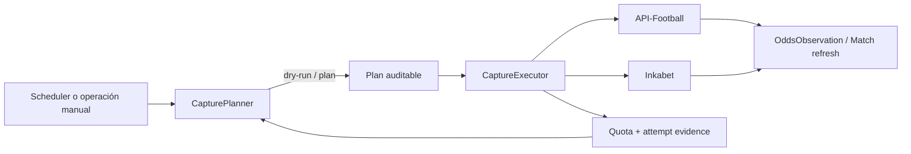

# FS-005 — Cadencia temporal de odds, cuota y planificación de captura — REFERENCE ONLY

| Campo | Valor |
|---|---|
| **Nombre durable** | `FS-005_odds_cadence_quota_research_REFERENCE_ONLY.md` |
| **Estado** | `REFERENCE ONLY` |
| **Proyecto** | `Finsport` |
| **Fecha de esta edición durable** | `2026-08-28` |
| **Contrato de investigación** | `FS-005_odds_cadence_quota_research_brief.md`, fechado `2026-08-27` |
| **Checkout de referencia** | `ljarufe/finsport`, branch `master`, commit `1e93e97c81888c688f0955927f3ea43dc818286c` |
| **Modo de producto** | `local-only / demo-only / research-oriented` |
| **Disposición** | Investigación de referencia previa al futuro ticket FS-005 |
| **Side effects financieros** | Ninguno |
| **Autoridad** | No sustituye specs/tickets aceptados; conserva conclusiones de research aprobadas |
| **Nota de edición** | Esta versión estabiliza referencias y aplica únicamente las correcciones de clasificación/cadencia/scheduler/quota-accounting aprobadas por el maintainer |

## Resumen ejecutivo y alcance

Finsport ya posee dos representaciones complementarias del mercado: `OddsSnapshot` como proyección latest/current y `OddsObservation` como historial temporal append-only. FS-003 estableció además la frontera que da sentido a FS-005: sin una observación de precio válida para el timestamp de decisión no debe formularse un claim histórico de `VALUE` o ROI. El propósito de FS-005 sigue siendo, por tanto, **adquirir evidencia temporal útil**, no diseñar una estrategia de apuestas. [FIN-MODELS] [FIN-FS003]

La conclusión central del research permanece:

```text
objetivo
!= maximizar número de requests

objetivo
= maximizar evidencia temporal útil por unidad de cuota
```

La cuota Free actualmente documentada por API-SPORTS es de `100 requests/day` con un límite de `10 requests/minute`. La integración directa de Finsport ya captura los cuatro headers relevantes de cuota/rate limit, aplica pacing secuencial y limita retries y paginación. Para suscripciones directas del dashboard de API-FOOTBALL, la documentación oficial actual sitúa el reset diario en `00:00:00 UTC`. [EXT-RATE, § “Subscription plans and limits” y § “Rate limit headers”] [EXT-PRICE, § “Pricing”] [EXT-TOS, § “SUBSCRIPTION ON DASHBOARD.API-FOOTBALL.COM”] [FIN-CLIENT] [FIN-SETTINGS]

Para `/odds` pre-match, la fuente oficial actual más explícita establece una retención de **siete días**, disponibilidad típica desde uno a catorce días antes del fixture, actualización del upstream aproximadamente **cada tres horas** y paginación de `10` resultados por página. Esto reemplaza para el contrato actual la recomendación legacy de 2020 que hablaba de tres meses de history sobre API-Football v2. [EXT-GUIDE, § “/odds - Pre-match odds” y § “Endpoint quick reference”] [EXT-LEGACY-HISTORY]

De ahí se mantiene una distinción obligatoria:

```text
Finsport polling frequency
!=
API-Football upstream update frequency
```

Una ejecución de Finsport cada pocos minutos no implica que el proveedor esté generando estados nuevos cada pocos minutos. El hecho de que FS-003 permita preservar otra `OddsObservation` con precio idéntico en un timestamp real posterior tampoco justifica polling indiscriminado: una observación idéntica sólo merece pagar una nueva request si completa una ventana temporal informativamente relevante. [EXT-GUIDE, § “/odds - Pre-match odds”] [EXT-OPT, § “Avoid duplicate calls” y § “Conclusion”] [FIN-FS003]

La política temporal durable queda deliberadamente expresada sin congelar un cutoff concreto:

```text
early + middle + at most one configurable near-kickoff candidate
```

`T-1h`, `T-30m`, `T-15m` u otra posición near-kickoff **no se elige en esta referencia**. Esa decisión permanece pendiente exclusivamente de los hallazgos de sensibilidad a precio/cutoff provenientes de FS-004.

El query shape actual:

```text
/odds
?fixture=<fixture_id>
&bet=<Match Winner bet id>
```

se reclasifica como **`CURRENT BASELINE`**, no como decisión cerrada. Es exactamente el shape que ejecuta hoy `sync_football_day --with-odds`, y FS-002 ya observó que consultar odds globalmente por fecha podía resultar caro en páginas. Debe preservarse inicialmente, incluyendo su breadth de bookmakers, **salvo que el preflight de FS-005 demuestre otra forma de consulta con menor coste y la misma o mejor completitud y provenance**. [FIN-DAY] [FIN-FS002]

La arquitectura durable sigue siendo:

```text
CapturePlanner
→ decide

CaptureExecutor
→ ejecuta calls bounded

Scheduler
→ sólo despierta al planner
```

`hybrid` queda como **recomendación operativa**, no como implementación obligatoria. Las decisiones que sí quedan cerradas son: separar planificación del scheduler; que el scheduler sólo despierte; mantener operación manual; permitir deshabilitar scheduling automático; y no colocar business logic dentro de Beat o cron. El checkout ya contiene Celery/Beat, pero `CELERY_BEAT_SCHEDULE` está vacío intencionalmente y el runtime local conserva un modelo seguro sin ciclo automático de betting. [FIN-OPS] [FIN-SETTINGS]

El accounting del proveedor para requests fallidas continúa sin considerarse demostrado. Un probe específico puede hacerse más adelante, pero queda **opcional, bounded, read-only y no bloqueante**. Mientras el comportamiento siga desconocido:

```text
cada HTTP attempt
→ se presupuesta conservadoramente
  como potencial consumidor de una request
```

La ausencia de cuota disponible para ese probe, o la imposibilidad práctica de ejecutarlo, **no bloquea FS-005**.

No se ejecutaron nuevas probes live para producir esta edición durable: el contenido técnico ya estaba aprobado y esta pasada se limitó a estabilizar referencias y aplicar las correcciones solicitadas.

## Evidencia durable del proveedor y checkout actual

La fotografía de repositorio utilizada para estabilizar paths es `master@1e93e97c81888c688f0955927f3ea43dc818286c`, merge de FS-004 del `2026-08-27`. FS-003 había sido integrado en `31738266ce19eadabc2ec30dfa85c8c80cea8f0e` y FS-002 en `fd766e858b31f03eb81070a739cf211df7eb0311`. Los paths indicados debajo existen en ese snapshot. [FIN-ROOT]

**Call graph real.**

| Camino actual | Provider / endpoint | Shape actual | Coste HTTP antes de retries | Paginación | Evidencia persistida / efecto | Cadencia apropiada |
|---|---|---|---:|---|---|---|
| `sync_football_catalog` | API-Football `/leagues` | sin filtros | `pages(/leagues)` | Sí, vía `get_all` | Competition/Season/coverage | Ocasional; no cada wake |
| `sync_football_catalog` | API-Football `/odds/bets` | sin filtros | `pages(/odds/bets)` | Sí | Catálogo Match Winner/1X2 | Ocasional; reference data |
| `sync_football_season` | API-Football `/fixtures` | `league + season + timezone` | `pages(fixtures)` | Sí | Fixtures/teams/matches canónicos | Bootstrap/maintenance, no rutina diaria |
| `sync_football_day` | API-Football `/fixtures` | `date + timezone=America/Lima` | `pages(fixtures)` | Sí | Fixture status, kickoff, score, outcome | Discovery/result lifecycle |
| `sync_football_day --with-odds` | API-Football `/odds` | `fixture + bet=Match Winner` | `Σ pages(odds_fixture)` | Sí | `OddsSnapshot` + `OddsObservation` | Capturas planificadas |
| Rama Inkabet | Inkabet `widgets/categories/v2` | una discovery call | `1` | No paginación implementada | Reconciliation refs | Separada de API-Football |
| Rama Inkabet | Inkabet `widgets/accordion/v1` | `eventId + groupableId=MW3W` | `1` por match resuelto | No paginación implementada | 1X2/MW3W Inkabet | Separada; fail-soft |

Fuentes de checkout: [FIN-CATALOG] [FIN-SEASON] [FIN-DAY] [FIN-CLIENT] [FIN-INKABET] [FIN-SYNC].

`sync_football_day` hace primero un único fetch global de fixtures para la fecha local y filtra después contra `Competition.enabled`. Sólo los matches aceptados con `Season.coverage["odds"] is True` llegan a la rama API-Football de odds. La rama Inkabet ocurre después, con una llamada a categorías y una llamada MW3W por ref resuelta; sus errores se degradan localmente sin invalidar la ingestión primaria. [FIN-DAY]

El cliente API-Football contabiliza cada intento HTTP en `client.calls`, lee headers tanto en respuestas exitosas como en `HTTPError`, pagina según `paging.current/total`, rechaza una operación si `total > API_FOOTBALL_MAX_PAGES`, y verifica que el proveedor no cambie inesperadamente la geometría de paginación durante el recorrido. En el snapshot inspeccionado, los defaults son `API_FOOTBALL_MAX_PAGES=25`, `API_FOOTBALL_MAX_RETRIES=2`, `API_FOOTBALL_MINIMUM_INTERVAL=6.0` segundos y reserve local `0`. Esos defaults son límites técnicos actuales, no la política final de FS-005. [FIN-CLIENT] [FIN-SETTINGS]

El coste correcto no es “una invocación de `get_all` equivale a una request”. Es:

```text
coste de get_all
=
número real de páginas HTTP
+
HTTP attempts adicionales por retry
```

Por ello, una operación paginada debe planificarse según un worst case admisible antes de empezar, no sólo según el coste de la primera página.

**Tabla obligatoria de provider evidence.**

| Fact | Official source/date | Live probe / evidencia local | Finsport behavior | Confidence | Durable decision |
|---|---|---|---|---|---|
| Daily quota Free = `100/day` | API-SPORTS, 2026-07-27 [EXT-OPT]; pricing oficial [EXT-PRICE] | FS-002 documentó headers reales y `daily_remaining` durante UAT [FIN-FS002] | Lee `x-ratelimit-requests-limit/remaining` | Alta | No hardcodear `100` como arquitectura; usar provider-reported quota |
| Free per-minute = `10/min` | API-SPORTS, 2026-06-12 [EXT-RATE] | No se re-probó en esta edición | Pacing default 6 s; se adapta a `minute_limit` si header existe [FIN-CLIENT] | Alta | Respetar header y pacing; no burst |
| Reset diario directo = `00:00 UTC` | Pricing actual [EXT-PRICE]; Terms dashboard [EXT-TOS] | No se hizo probe de rollover | App trabaja en Lima pero cuota debe tratarse en UTC | Alta para subscription dashboard | No asumir midnight Lima; reconcile con header después del reset |
| Daily headers | API-SPORTS, 2026-06-12 / 2026-07-27 [EXT-RATE] [EXT-OPT] | Ya consumidos por cliente actual [FIN-CLIENT] | Guarda limit/remaining en memoria | Alta | Header = observación autoritativa de runtime |
| Minute headers | API-SPORTS, 2026-06-12 / 2026-07-27 [EXT-RATE] [EXT-OPT] | Ya consumidos por cliente actual | Guarda limit/remaining en memoria | Alta | Usarlos para pacing y backpressure |
| `/odds` history actual = últimos `7 días` | API-SPORTS, 2026-03-13 [EXT-GUIDE] | No nuevo probe; UAT actual confirmó acceso a odds actuales [FIN-FS002] | Finsport preserva history propio | Alta | No depender de recuperación retroactiva; capturar prospectivamente |
| Claim legacy de `3 meses` | API-SPORTS, 2020-10-27, tutorial v2 [EXT-LEGACY-HISTORY] | N/A | No forma parte del contrato actual | Baja para v3 actual | Considerarlo stale/superseded |
| Odds pre-match update ≈ `3h` | API-SPORTS, 2026-03-13 [EXT-GUIDE] | FS-003 vio estados idénticos y cambios entre capturas, sin medir período estadístico [FIN-FS003] | Polling actual es manual, no scheduler denso | Alta como cadence publicada; variación fixture/bookmaker posible | No poll más rápido por defecto que la generación de novedad upstream |
| `/odds` = `10/page` | API-SPORTS, 2026-03-13 [EXT-GUIDE] | FS-002 observó que query global por fecha podía multiplicar páginas [FIN-FS002] | `get_all` recorre todas las páginas | Alta | Pagination forma parte del budget |
| 429 = rate limit | API-SPORTS, 2026-03-13 y 2026-06-12 [EXT-GUIDE] [EXT-RATE] | Cliente lo mapea a `APIFootballRateLimitError` | No tight retry de 429 | Alta | Stop/backoff; no gastar reserve en loop |
| HTTP 200 puede contener provider error/zero results | API-SPORTS, 2026-03-13 [EXT-GUIDE] | Cliente inspecciona `errors` del payload [FIN-CLIENT] | Error del provider no se trata como dato válido | Alta | Persistir resultado/razón; no retry ciego |
| Failed-call quota accounting | No hay contrato suficientemente explícito encontrado en fuentes aprobadas | No se ejecutó probe específico | `client.calls` cuenta attempts locales, no demuestra billing del provider | Desconocida | Cada HTTP attempt se presupuesta como potencial request; probe opcional y bounded |
| Timeout accounting | No documentado con suficiente precisión para billing | No probe específico | Timeouts tienen retries bounded [FIN-CLIENT] | Desconocida | Cada timeout attempt se presupuesta conservadoramente |
| Retry cost | La guía advierte que retry pobre puede aumentar consumo [EXT-OPT] | Cliente actual puede reintentar 5xx/network según bound [FIN-CLIENT] | Cada retry incrementa `client.calls` | Alta para coste local; conservadora para provider quota | Incluir retry contingency en preflight |
| Shared-IP effects | API-SPORTS, 2026-06-12 [EXT-RATE] | No probe | Local runtime puede compartir salida IP | Alta | Header observado prevalece sobre estimación aislada |

**Resolución de la contradicción de retención.**

La contradicción documental obligatoria queda resuelta así:

| Claim | Fuente | Endpoint/era | Aplicabilidad | Disposición |
|---|---|---|---|---|
| Odds history de 3 meses | “HOW TO SAVE CALLS TO THE API”, API-SPORTS, `2020-10-27` | Ejemplos explícitos API-Football `v2` / RapidAPI | Legacy | No usar para FS-005 |
| Odds history de 7 días; update cada 3 h | “HOW TO GET STARTED WITH API-FOOTBALL: THE COMPLETE BEGINNER'S GUIDE”, API-SPORTS, `2026-03-13` | API-Football `v3`, `/odds` | Contrato oficial actual | Usar como baseline actual |
| Historial local de largo plazo | Finsport `OddsObservation` | Persistencia propia | Independiente del retention window remoto una vez capturado | Mantener append-only |

[EXT-LEGACY-HISTORY] [EXT-GUIDE] [FIN-MODELS] [FIN-FS003]

Por tanto:

```text
provider retention corta
+
Finsport OddsObservation append-only
→ FS-005 debe adquirir evidencia prospectiva
  en lugar de esperar reconstruirla después
```

**`fixture + bet=Match Winner` — CURRENT BASELINE.**

La implementación actual llama `/odds` una vez por fixture relevante y añade `bet=<market.external_id>`, donde el catálogo resuelve `Match Winner` o `1X2`. La documentación actual permite filtrar `/odds` por fixture, league/season, date, bookmaker o bet y confirma que un request por fixture puede devolver múltiples bookmakers, con paginación cuando corresponde. [FIN-DAY] [EXT-GUIDE, § “/odds - Pre-match odds”]

FS-002 registró un hallazgo brownfield especialmente importante: una consulta global de odds por fecha resultó costosa en páginas, razón por la que el flujo rutinario se llevó a odds por fixture. Además, una UAT real persistió Match Winner de numerosos bookmakers —incluidos, entre otros, Bet365, Pinnacle, Betfair, Unibet y William Hill— con el query per-fixture. [FIN-FS002]

Disposición durable:

```text
fixture + bet=Match Winner
→ CURRENT BASELINE

preservar inicialmente
→ sí

puede cambiar en preflight FS-005
→ sólo si otra query shape demuestra simultáneamente:

   lower request/page cost
   AND same-or-better completeness
   AND same-or-better provenance
```

Reducir bookmaker breadth no es una optimización gratuita. Puede ahorrar payload o páginas en ciertas formas de consulta, pero también elimina evidencia que FS-003/Finsport puede usar más adelante para consenso, dispersión y weighting. No debe introducirse silenciosamente ni basarse en una taxonomía hardcoded de bookmakers “sharp” o “recreational”.

**Fixture y result refresh.**

La guía oficial actual distingue datos live de fixtures futuros: el endpoint live puede cambiar muy rápido, pero para fixtures futuros no existe razón para adoptar esa misma frecuencia y la propia guía considera suficiente una actualización mucho menos frecuente. Además, `/fixtures` permite agrupar hasta veinte fixture IDs mediante `ids=...`, lo que ofrece una ruta potencialmente eficiente para refresh dirigido de matches ya conocidos. [EXT-GUIDE, § “/fixtures” y § “Practical tips”] [EXT-OPT, § “Avoid duplicate calls”]

Para FS-005, esto implica:

```text
fixture discovery
→ detectar fixtures + reschedules + status lifecycle

result refresh
→ resolver outcomes canónicos después de kickoff

ambos
→ cuota protegida

ninguno
→ debe heredar automáticamente cadence de live-score
```

El batching con `ids` es una **opción de preflight**, no una implementación cerrada en este documento. Debe verificarse con el plan/query exactos antes de convertirlo en acceptance de código.

Los estados canónicos reconocidos actualmente por `football/sync.py` como finalizadores del outcome incluyen `FT`, `AET`, `PEN`, `AWD` y `WO`. FS-005 debe conservar esa semántica de ingestión canónica y no confundirla con filtros experimentales específicos de FS-003 que puedan excluir determinados resultados para modelado. [FIN-SYNC] [FIN-FS003]

**Inkabet.**

Inkabet permanece como fuente secundaria read-only. El cliente actual:

```text
GET widgets/categories/v2
GET widgets/accordion/v1?eventId=<id>&groupableId=MW3W
```

usa configuración local `brandId`/`marketCode`, `x-sb-type=b2b`, suprime `Accept-Encoding`, tiene timeout y no contiene accounting público equivalente al de API-Football. [FIN-INKABET] [FIN-FS002]

No se extrapolan a Inkabet:

```text
100/day
10/min
3h upstream update
7-day retention
API-Football headers
```

Su cadence se planifica separadamente. Su fallo es fail-soft: una indisponibilidad de categories o de un MW3W individual no debe anular fixtures u odds primarias ya obtenidas. [FIN-DAY] [FIN-FS002] [FIN-FS003]

## Coste, cuota, cadencia y selección

El modelo de coste aprobado se conserva:

```text
daily_cost =
    fixture_discovery_calls
  + odds_capture_calls
  + result_refresh_calls
  + pagination
  + retries
  + manual/maintenance reserve
```

Para evitar contar una operación lógica como si fuera una request, conviene expresarlo en HTTP attempts:

```text
A_odds
  = Σ pages realmente solicitadas por cada captura de odds
    + retry attempts

A_fixture
  = pages de discovery/refresh
    + retry attempts

A_catalog
  = pages de /leagues y /odds/bets
    + retry attempts

daily_attempt_budget
  = A_odds
  + A_fixture
  + A_catalog
  + A_other
  + protected_reserve
```

Mientras el provider no haya demostrado de forma inequívoca el accounting de failed requests:

```text
budgeted_request_cost(HTTP attempt) = 1
```

Esto es deliberadamente conservador.

**Quota como estado de runtime.**

La relación durable es:

```text
local estimate
→ planning aid

provider headers
→ authoritative observation
```

Un planner puede empezar con una estimación local de consumo desde la última observación, pero al recibir headers válidos debe reconciliarse con ellos. Si `local_remaining > provider_remaining`, prevalece el provider. Si `local_remaining < provider_remaining`, tampoco se “regala” capacidad automáticamente sin registrar la reconciliación: puede existir otro proceso, una operación manual o tráfico desde la misma cuenta/IP. [EXT-RATE] [FIN-CLIENT]

Si los headers faltan, el comportamiento debe ser fail-closed respecto de operaciones no esenciales que no puedan demostrarse dentro del budget. No se recomienda un contador eterno de tipo:

```text
remaining -= 1
```

sin reset/reconciliación.

La cuota diaria no debe modelarse como “medianoche de Lima”. Para la integración directa, el boundary actual es `00:00 UTC`; Finsport puede seguir mostrando/planificando fixtures en `America/Lima`, pero quota reset y kickoff son conceptos temporales distintos. [EXT-PRICE] [EXT-TOS] [FIN-SETTINGS]

**Reserva.**

No se congela un porcentaje. El contrato conceptual mantiene buckets separados:

```text
mandatory / safety reserve
fixture discovery
pre-match odds
result refresh
manual / incident reserve
catalog / maintenance
```

La reserva debe ser configurable y expresarse preferentemente en requests absolutas para un plan pequeño, aunque puede derivarse de un porcentaje para planes de mayor capacidad. La regla importante no es el formato sino:

```text
si worst_case(operation) no cabe
sin invadir protected reserve
→ no empezar la operación
```

Una operación parcial cuya página uno cabe pero cuya paginación previsible no cabe no debe iniciarse alegremente. El primer response puede refinar el estimate con `paging.total`; si el total descubierto excede el bound permitido, la ejecución debe parar de forma explícita y auditable en vez de consumir toda la reserva.

El cambio a un plan pago altera capacidad, no arquitectura:

```text
provider reports larger limits
→ planner can schedule more work

planner/executor/reserve/idempotency
→ permanecen
```

`100` nunca debe convertirse en constante de dominio.

**Tabla obligatoria de call budget.**

Para evitar convertir escenarios de investigación en configuración de producto, se parametriza el coste.

Definiciones:

```text
Q = provider daily remaining observado
R = quota protegida/reserve
F = coste de fixture discovery del día
G = coste de result refresh del día
E = contingency máxima admitida para retry attempts
P = páginas promedio/worst-case presupuestadas por captura odds
N = fixtures capturados por día
W = ventanas por fixture
```

Entonces:

```text
Total = F + G + E + (N × W × P) + R

N_max =
floor(
  (Q - R - F - G - E)
  /
  (W × P)
)
```

| Profile | Fixtures/day | Windows | Odds calls | Pagination | Results | Reserve | Total | Fits Free? |
|---|---:|---:|---:|---:|---:|---:|---:|---|
| `MINIMAL` | `N_m` | `1` | `N_m × P` | incluida en `P` | `G` | `R` | `F + G + E + N_m×P + R` | Sí sólo si `Total ≤ Q` |
| `BALANCED` | `N_b` | `2` | `2 × N_b × P` | incluida en `P` | `G` | `R` | `F + G + E + 2N_b×P + R` | Sí sólo si `Total ≤ Q` |
| `RESEARCH_HEAVY` | `N_r` | hasta `3` | `≤3 × N_r × P` | incluida en `P` | `G` | `R` | `F + G + E + ≤3N_r×P + R` | Sí sólo si `Total ≤ Q` |

Los nombres son perfiles de análisis, no enums obligatorios.

`MINIMAL` prioriza breadth y al menos una evidencia pre-kickoff por fixture más resolución de outcome. `BALANCED` cubre dos puntos temporalmente distintos y protege resultados. `RESEARCH_HEAVY` reduce el conjunto de fixtures/competitions para dedicar hasta tres capturas semánticamente distintas a movimiento temporal. El tercer punto sólo puede ser el candidate near-kickoff configurable; no autoriza múltiples probes sub-hour.

En Free, `P` importa tanto como `W`. Dado que `/odds` pagina a diez resultados por página, un shape que parezca “una llamada por fixture” puede costar dos o más requests si el set de resultados cruza páginas. [EXT-GUIDE, § “Pagination” y § “/odds - Pre-match odds”]

**Candidate capture windows.**

La evidencia actual no justifica una rejilla densa. La actualización publicada de pre-match odds es aproximadamente cada tres horas, y la literatura oficial de optimización insiste en adecuar polling a la frecuencia real de cambio en lugar de usar una frecuencia uniforme. [EXT-GUIDE] [EXT-OPT]

| Window | Purpose | Upstream novelty | Quota cost | Current need | Future value | Keep/Defer/Drop |
|---|---|---|---:|---|---|---|
| `early` configurable | Capturar baseline antes de que el fixture entre a la zona de decisión | Alta frente a “sin observación”; después depende de momento real de disponibilidad | 1 capture | Sí, para history prospectivo | Alta | **KEEP** |
| `middle` configurable | Medir movimiento entre baseline y etapa cercana al kickoff | Razonable si está suficientemente separada del punto early/upstream refresh | 1 capture | Útil | Alta | **KEEP** |
| `at most one configurable near-kickoff candidate` | Dar precio timestamp-valid próximo al futuro cutoff y medir deterioro/movimiento | No se presupone alta; depende de FS-004 y del momento de upstream update | como máximo 1 capture | Potencialmente importante | Alta | **KEEP candidate / DEFER exact time** |
| Secuencia densa `T-1h + T-30m + T-15m + T-10m + T-5m` | Intentar aproximar “closing” por fuerza bruta | Probablemente muy redundante frente a upstream ≈3 h, salvo evidencia contraria | 5+ captures | No | Experimental | **DROP as default** |
| Polling fijo cada 5–15 min todo el pre-match | Maximizar samples por tiempo | No maximiza necesariamente estados nuevos | Muy alto | No | Bajo information/request | **DROP** |

La conclusión contractual queda exactamente:

```text
early + middle + at most one configurable near-kickoff candidate
```

No se decide aquí cuál de:

```text
T-1h
T-30m
T-15m
etc.
```

debe convertirse en el candidate near-kickoff. Ese mapping espera FS-004.

**Observaciones idénticas.**

FS-003 demostró que dos capturas legítimas en timestamps distintos pueden generar dos `OddsObservation` aun cuando el precio no cambie, y que eso es compatible con una única fila latest de `OddsSnapshot`. [FIN-FS003] [FIN-MODELS]

Por tanto:

```text
same price later
!= invalid observation
```

pero tampoco:

```text
same price later
→ poll again immediately
```

El criterio es si la observación posterior ocupa un bucket temporal que el dataset necesita. Esto permite medir, entre otras cosas, la tasa de respuestas idénticas como señal de baja novedad upstream.

**Eligibility.**

Un fixture sólo debe competir por cuota de odds si, como mínimo:

```text
Competition.enabled
Season known
coverage.odds == true
pre-match / not final
kickoff dentro del horizon configurado
canonical identity resolved
API-Football source ref resolved
```

Estos criterios se apoyan en los guards que ya existen en el daily sync y en la recomendación oficial de consultar `coverage` antes de gastar requests. [FIN-DAY] [FIN-SYNC] [EXT-OPT, § “Start by checking the available coverage”]

No debe ejecutarse una captura únicamente porque el modelo actual produce `HOME`, `DRAW` o `AWAY`.

**Selection bias.**

La captura exclusiva de decisiones seleccionadas por el modelo actual produciría:

```text
current policy
→ decide what market data survives
→ future policies evaluated on selected sample
→ selection bias
```

Eso perjudicaría comparación futura de thresholds, VALUE, consensus, bookmaker research o cualquier Modernized R45 posterior.

La protección durable es un modelo de dos capas:

```text
broad / stratified core sample
+
priority decision sample as supplement
```

El core debe representar fixtures elegibles de manera determinista y auditable por competición/día o strata equivalentes. `Decision interest` puede elevar prioridad una vez protegida la muestra base, pero no puede ser el único gate.

**Tabla obligatoria de priorización.**

| Signal | Rationale | Bias | Deterministic? | First implementation? |
|---|---|---|---|---|
| Outcome/result pending dentro de reserve | Sin outcome, el historial de odds no termina ligado a target canónico | Bajo | Sí | **Sí, reserve protegido** |
| Fixture de core sample con poca cobertura | Preserva breadth y reduce sesgo por modelo | Bajo/estratificado conocido | Sí | **Sí** |
| Due temporal window aún no cubierta | Completa early/middle/near candidate sin duplicar | Bajo | Sí | **Sí** |
| Fixture con menos `OddsObservation` válidas | Reduce desigualdad de cobertura | Puede sobreponderar fuentes problemáticas si se usa solo | Sí | Sí, como señal |
| No recent observation / última capture lejana | Mejora novelty probable | Bajo | Sí | Sí |
| Distancia a kickoff | Resuelve empates y urgencia real | Favorece slate temporal cercano | Sí | Sí, tie-breaker |
| Competition/day strata | Mantiene representación transversal | Sesgo explícito y auditable | Sí | Sí |
| Current `Decision` interest | Añade datos de casos económicamente interesantes | Sesgo de policy/modelo | Sí | **Sólo suplemento** |
| Optimizer multiobjetivo opaco | Podría exprimir calls numéricamente | Difícil de detectar/auditar | No suficientemente | **No** |

Todo skip debe tener un reason code explicable, por ejemplo:

```text
NOT_ELIGIBLE
NO_ODDS_COVERAGE
NOT_DUE
WINDOW_ALREADY_FULFILLED
QUOTA_RESERVE
WORST_CASE_DOES_NOT_FIT
LOWER_PRIORITY
MISSED_WINDOW
CONCURRENT_SINGLE_FLIGHT
SOURCE_DEGRADED
```

No se exige congelar estos strings exactos en esta referencia; se exige la semántica.

## Planificación, ejecución, scheduling y tolerancia a fallos

La separación arquitectónica aprobada permanece conceptual y deliberadamente independiente de Celery:



El scheduler **no decide qué fixture merece una llamada**. Sólo provoca una evaluación del planner.

Un `CapturePlanner` debe poder calcular, sin provider calls:

```text
now
known/reconciled quota state
eligible fixtures
candidate windows
due windows
priorities
estimated page/attempt cost
protected reserve
planned executions
skips + reason
```

Dry-run conserva estas invariantes:

```text
NO provider calls
NO quota consumption
NO fake OddsObservation
NO backdated OddsObservation
NO bookmaker side effects
NO financial side effects
```

El executor recibe trabajo acotado y ejecuta únicamente lo aprobado por el plan o por una invocación manual equivalente que use las mismas reglas. El scheduler nunca debe reconstruir business rules duplicadas.

**Scheduler comparison.**

| Option | Strengths | Weaknesses | Local safety | Missed-run handling | Observability | Recommendation |
|---|---|---|---|---|---|---|
| Celery Beat | Ya existe en runtime; integra worker/queue; wakeups frecuentes posibles | Añade broker/worker lifecycle y duplicate-delivery considerations | Alta si schedule sigue explícito y disableable | Requiere planner que detecte due/missed; Beat no debe “recordar negocio” | Buena con task/run IDs | Válido |
| cron | Simple; independiente del broker para wakeup | Entorno/locking/logs pueden ser menos uniformes | Alta si command es local y single-flight | Igual: planner debe resolver missed windows | Suficiente con logs/run persistence | Válido |
| manual command | Máxima seguridad y control durante research | No garantiza unattended timing | Muy alta | Operador puede iniciar catch-up; planner decide lateness | Muy explícita | **Obligatorio conservar** |
| hybrid | Manual siempre + scheduler opcional para wakes | Un poco más de superficies operativas | Alta si el scheduler es disableable | Bueno: planner común trata runs manuales/automáticos igual | Alta | **Recomendado, no obligatorio** |

La recomendación `hybrid` significa:

```text
manual path
+
optional automated wakeup
```

No significa “FS-005 debe implementar Celery Beat”.

Las decisiones durables son:

```text
planning separated from scheduler
scheduler only wakes
manual operation always available
scheduler can be disabled
no business logic inside Beat/cron
```

Esto encaja con el checkout actual: Celery y Beat están presentes, pero `CELERY_BEAT_SCHEDULE = {}` y el runtime local se diseñó expresamente para que persisted legacy schedules no reactiven el ciclo histórico de betting. [FIN-OPS] [FIN-SETTINGS]

**Desired window vs actual capture.**

Cada candidate debe distinguir:

```text
desired window identity
eligible-from / not-before
latest acceptable / not-after
actual executor start
actual provider response
actual observed_at
kickoff
lateness
```

Ejemplo conceptual:

```text
candidate:
near-kickoff

desired nominal point:
configurable

actual capture:
cuando realmente respondió el provider

persist:
actual observed_at
```

Nunca se ajusta `observed_at` hacia atrás para fingir que la máquina ejecutó en la hora deseada.

Si una máquina estuvo apagada:

```text
todavía dentro de tolerance
→ LATE_CAPTURE

fuera de tolerance
→ MISSED_WINDOW

nunca
→ synthetic/backdated capture
```

El distinction permite medir reliability sin contaminar market history.

**Idempotency.**

La unidad de idempotencia no puede ser simplemente:

```text
fixture
```

porque un mismo fixture debe poder recibir early, middle y una captura posterior legítima.

Tampoco puede ser:

```text
identical price
```

porque un quote idéntico posterior puede ser evidencia válida.

La identidad conceptual apropiada es:

```text
provider
+
canonical fixture
+
intended candidate/window
+
planner policy/version
```

o equivalente durable.

Invariante:

```text
same intended window
→ at most one successful logical execution

later distinct due window
→ allowed
```

Un duplicate delivery de scheduler, reintento manual accidental o process restart no debe convertir el mismo intended window en dos llamadas independientes sólo porque el trigger fue distinto.

**Concurrency.**

El checkout actual permite `CELERY_WORKER_CONCURRENCY=2`; además un operador puede lanzar comandos manuales. Por eso asumir “local-only = jamás hay concurrencia” no es seguro. [FIN-SETTINGS]

No se necesita distributed scheduling enterprise. Para un solo operador local, una estrategia simple tipo:

```text
single-flight
+
atomic claim
+
fail-closed
```

es preferible.

Dos planners pueden leer; sólo uno debe poder reclamar el mismo execution unit. Dos executors simultáneos tampoco deben poder consumir independientemente una reserve que ambos calcularon sobre el mismo `remaining`.

Esto refuerza la necesidad de que el planner trate el header como observación autoritativa, pero no confíe en él como mutex.

**Failed-call accounting probe.**

El comportamiento de cuota ante errores deliberados no se considera suficientemente resuelto como para incorporarlo como supuesto optimista.

Un probe futuro, sólo si aporta valor y existe cuota holgada, puede estar definido así:

```text
type:
optional validation

read-only:
yes

bounded:
yes

secrets in output:
no

known maximum calls before starting:
required

deliberate quota exhaustion:
forbidden

FS-005 blocker:
no
```

Una forma razonable sería comparar `x-ratelimit-requests-remaining` antes/después de un error inocuo y controlado que no comprometa credenciales ni provoque firewall, con un máximo de llamadas predeclarado. Pero **este probe no es acceptance obligatorio**.

Mientras siga desconocido:

```text
HTTP 4xx attempt
HTTP 5xx attempt
timeout attempt
network attempt whose server receipt is unknown
retry attempt
→ cada uno reserva conservadoramente hasta 1 request
```

**Failure policy.**

| Condition | Retry now? | Later? | Spend reserve? | Persist? | Evidence |
|---|---|---|---|---|---|
| `401/403` | No | Sólo tras corregir auth/config | No | Sí | HTTP/provider error sanitizado |
| `429` | No tight retry | Sí, después de backoff/rate reset si todavía due | No para bucle de rescue | Sí | Headers + error + planned/actual attempts |
| `499` / timeout | Como máximo retry bounded si budget ya lo contemplaba | Sí si ventana sigue válida | No más allá del contingency aprobado | Sí | Latency/error/attempt count |
| `5xx` | Bounded retry | Sí si todavía informativamente útil | Sólo contingency previamente presupuestada | Sí | HTTP code/retry count |
| Network error | Bounded; asumir attempt potencialmente cobrado | Sí | Contingency, no reserve general | Sí | Error class + timing |
| HTTP 200 + `errors` | No retry ciego | Sólo si causa transitoria demostrable | No | Sí | Provider error payload sanitizado |
| HTTP 200 + zero results | No automático | Sólo por política temporal/contextual | No | Sí | Results=0 + query metadata |
| Partial pagination failure | No restart infinito | Sí sólo si se puede mantener semántica/auditar parcialidad | No agotar reserve | Sí | Pages completed/failed |
| Quota low | No | Después de reset/reconcile | **Preservar reserve** | Sí | Skip reason + remaining |
| Worst-case operation no cabe | No empezar | Replanificar más tarde | No | Sí | Estimated cost |
| Inkabet categories failure | No tight loop | Más tarde | No tocar API-Football reserve | Sí | `INKABET_DEGRADED` |
| Inkabet match failure | Continuar otros eventos | Más tarde si vale la pena | No bloquear primary | Sí | Event/source error |

API-SPORTS advierte que 429 debe conducir a ralentización/backoff y que retries mal diseñados aumentan consumo; también contempla firewall blocking frente a patrones abusivos. [EXT-RATE] [EXT-OPT]

El cliente actual ya diferencia 401/403, 429, 5xx y network/timeout, con retries bounded para clases transitorias. [FIN-CLIENT]

**Fixture discovery.**

La discovery no debe repetirse en cada candidate de odds. Un response de fixture puede reutilizarse para canonical identity, kickoff y status. La documentación oficial actual recomienda adecuar refresh al tipo de dato y evitar requests duplicadas. [EXT-OPT]

La política de investigación mantiene:

```text
discover future fixtures
→ suficientemente temprano para planificar candidates

refresh fixture lifecycle
→ cuando existe riesgo razonable de reschedule/status change

odds candidate
→ no vuelve a descubrir fixture por necesidad
```

Postponed/cancelled/suspended fixtures deben quedar explicitados por status y replanificación; no desaparecer silenciosamente del dataset.

**Result refresh.**

La cuota de outcomes es obligatoria conceptualmente. Gastar todo el día en pre-match y no poder resolver ningún fixture produce un dataset de prices sin labels canónicos.

Por ello:

```text
result refresh reserve
→ protected

pre-match optional captures
→ pueden ser skipped antes
```

El uso de `/fixtures?ids=<...>` con hasta veinte IDs por request es un candidate de batching particularmente prometedor para results, pero continúa sujeto a preflight de plan/completitud. [EXT-OPT, § “Avoid duplicate calls”]

No se congela en esta referencia una secuencia rígida “T+X minutos, T+Y horas”. La condición relevante es status/outcome state y budget. Un match no final puede volver a competir por refresh más tarde; uno final no debe seguir gastando cuota rutinariamente.

**Timezones.**

Finsport usa `TIME_ZONE="America/Lima"` y pasa esa zona al daily fixture query. [FIN-SETTINGS] [FIN-DAY]

El diseño temporal debe separar:

```text
planner display/local calendar
→ America/Lima

kickoff identity
→ timezone-aware absolute datetime

provider quota reset
→ UTC

provider response timestamps
→ parse aware datetime

scheduler timezone
→ puede diferir, pero sólo despierta
```

Nunca usar naive datetimes para decidir due/missed/cutoff. El código de sync ya convierte a aware datetime un provider datetime naive antes de persistirlo. [FIN-SYNC]

## Observabilidad, perfiles operativos y UAT

La observabilidad mínima debe permitir responder después, sin volver a gastar requests:

```text
por qué se llamó
por qué no se llamó
cuánto se esperaba gastar
cuánto se gastó
qué página/attempt falló
qué headers devolvió provider
qué evidence se creó
qué window quedó cumplida
qué window se perdió
```

El command actual ya emite parte de esta evidencia: `created`, `updated`, `unchanged`, `skipped`, reconciliation counts, `calls`, `inkabet_calls`, `inkabet_errors`, `daily_remaining` y `error`. FS-005 necesita complementar eso con semántica de plan/window/attempt, no eliminarlo. [FIN-SYNCBASE]

La persistencia actual de football ya contiene timestamps reales de fixture y odds. `OddsObservation` está indexada por match/time y por identidad de market/source/bookmaker/time; `provider_updated_at` puede conservar el timestamp upstream cuando esté disponible. [FIN-MODELS]

**Mínimo de evidencia recomendado.**

No queda cerrada una obligación de crear cuatro modelos Django distintos. La capacidad requerida puede implementarse con una extensión de una entidad de run existente, una combinación de modelos pequeños o structured logs más un registro durable. Lo que sí debe quedar recuperable es:

| Dimensión | Evidencia mínima |
|---|---|
| Plan | plan time, planner version/config, quota basis |
| Candidate | provider, fixture, intended window, due interval |
| Cost | expected calls/pages, worst-case allowance |
| Priority | priority inputs y rank/tie-break |
| Decision | execute/skip + reason |
| Execution | start/end, pages, HTTP attempts, retries |
| Provider | status/error, latency, daily/minute headers |
| Data | observations created, snapshots created/updated/unchanged |
| Temporal | desired vs actual delta, lateness, missed state |
| Quota | observed limit/remaining, reserve antes/después |
| Concurrency | execution identity/claim/duplicate suppression |

Structured logs solos pueden servir para diagnóstico, pero no son ideales si la misma evidencia debe ser consultada para idempotencia. Algún estado durable debe permitir contestar “¿este intended window ya fue reclamado/completado?” sin depender de scrollback.

No se congela todavía si eso se llamará:

```text
CapturePlan
CaptureAttempt
QuotaObservation
SyncRun extension
```

La decisión de schema corresponde al futuro ticket tras preflight.

**Métricas.**

Las métricas se mantienen separadas; no se resumen en un score opaco.

| Familia | Métricas |
|---|---|
| Quota | allocated, consumed/attempts, remaining, reserved, calls by purpose, retries |
| Coverage | eligible fixtures, captured fixtures, observations/fixture, candidates fulfilled, competition/day coverage |
| Freshness | desired→actual delta, observation age, provider timestamp age |
| Reliability | successes, timeouts, 429, partial pagination, missed windows |
| Data-value | first-observation yield, price-change yield, bookmaker-set-change yield, identical-response rate, useful-window completion |

La `identical-response rate` es especialmente valiosa para falsar cadence demasiado densa. Una alta tasa sostenida entre candidates próximos es señal para reducir polling; no un incentivo para aumentarlo.

**Interpretación de los tres perfiles.**

| Profile | Research intent | Temporal pattern | Selection breadth | Quota posture |
|---|---|---|---|---|
| `MINIMAL` | Maximizar fixtures con evidencia básica | un candidate pre-kickoff útil | Amplia | Conservadora |
| `BALANCED` | Capturar evolución sin densidad excesiva | early + otro candidate distinto | Moderada/amplia | Balanceada |
| `RESEARCH_HEAVY` | Estudiar market movement | early + middle + como máximo un near-kickoff candidate | Menor / estratificada | Más cuota por fixture |

Los perfiles no son configuración productiva congelada. Sus límites efectivos salen cada día de:

```text
provider remaining
− protected reserve
− mandatory work
− worst-case pagination/retry allowance
```

**UAT económico en cuota.**

La futura validación puede conservar el diseño del brief:

| UAT | Provider calls máximas | Qué demuestra | Persistencia esperada |
|---|---:|---|---|
| Dry-run | `0` | planner determinista, eligibility, priority, reserve | Plan/skips, ninguna observation |
| Bounded real capture | predeclarado antes de ejecutar | boundary real API + observation persistence | Attempts, headers, observations |
| Repeated planner invocation | `0` adicional si sólo replanifica | idempotency del intended window | Mismo plan/no duplicate execution |
| Header reconciliation | Incluido en una call útil existente cuando sea posible | provider remaining vs local estimate | Quota observation |
| Failure simulation | `0` real preferido mediante mock; como máximo bounded si controlado | 429/timeout/error policy | Attempt/failure evidence |
| Result refresh | predeclarado | fixtures terminan ligados a outcomes | Match status/outcome + run evidence |
| Failed-call quota probe | **opcional**; máximo explícito antes de empezar | sólo accounting de error si vale la cuota | Headers before/after; no blocker |

No debe repetirse una call consumidora de cuota sólo para volver a mostrar un dato perdido en terminal. La evidencia de UAT debe persistirse o guardarse en output durable sanitizado.

**Acceptance candidates para el futuro FS-005.**

Esto **no es el ticket de implementación**; son propiedades que el research considera candidatas a acceptance:

```text
planner dry-run makes zero provider calls

provider-reported quota can override/reconcile local estimates

planner will not intentionally cross protected reserve

every HTTP attempt is conservatively budgeted while failed-call accounting is unknown

due candidate windows are deterministic

same intended candidate is not executed twice

a genuinely later distinct candidate remains legal

OddsObservation always stores actual timestamp

no fake/backdated observations

pagination and retries are included in worst-case cost

API-Football rate limit is paced

429 does not trigger tight retry

skips expose explicit reasons

result refresh cannot be starved by optional odds capture

API-Football material failure is visible

Inkabet remains fail-soft

quota exhaustion fails closed for nonessential work

scheduler contains no business logic

manual operation remains available

scheduler can be disabled

all cutoff/kickoff/window calculations are timezone-aware

no real betting or financial side effects
```

El future ticket también deberá incluir un preflight que contraste el `CURRENT BASELINE` de odds contra cualquier alternativa propuesta antes de cambiarlo:

```text
current:
fixture + bet=Match Winner

candidate alternative:
any different query shape

candidate wins only if:
lower measured/bounded cost
AND completeness >= current
AND provenance >= current
```

Ese preflight debe incluir pagination, no sólo payload size.

## Inputs pendientes de FS-004

Esta sección queda reservada **únicamente** para incorporar el handoff de sensibilidad a precio/cutoff de FS-004.

No debe reabrir:

```text
provider quota
headers
reset
pagination
history retention
upstream refresh
planner/executor separation
scheduler principles
selection-bias safeguard
observability
idempotency
result reserve
```

Los únicos inputs que pueden entrar aquí son hallazgos del tipo:

| FS-004 input | Pregunta para FS-005 | Clasificación futura |
|---|---|---|
| Price deterioration sensitivity | ¿Cuánto valor se pierde al observar un precio más temprano/tardío? | `changes cadence` / `no change` / `future experiment only` |
| Kelly/value edge sensitivity | ¿Cambios pequeños de cuota alteran materialmente la policy ranking? | idem |
| Relevant odds bands | ¿Hay rangos de precio donde timing importa más? | idem |
| Recovery stake sensitivity to odds | ¿La degradación de price cambia exposición de forma material? | idem |
| Useful decision cutoff assumptions | ¿Qué tan cerca del kickoff necesita existir una quote válida? | idem |
| Small-price-change policy sensitivity | ¿Un movimiento pequeño justifica una captura adicional? | idem |

La conclusión temporal que llega al handoff es:

```text
early
+
middle
+
at most one configurable near-kickoff candidate
```

FS-004 debe ayudar únicamente a elegir si ese tercer candidate aporta suficiente valor y, en caso afirmativo, dónde ubicarlo:

```text
T-1h?
T-30m?
T-15m?
otra posición?
```

No se presupone la respuesta.

Procedimiento de ingestión:

```text
read FS-004 handoff
→ extract price/cutoff sensitivity only
→ map each finding to candidate-window value
→ keep/remove/reposition candidate based on evidence
→ preserve unbiased core sample
→ recompute quota envelope
→ freeze future FS-005 ticket
```

Hasta entonces, cualquier documento que convierta `T-30m`, `T-15m` o `T-1h` en la ventana oficial contradice esta referencia.

## Decisiones durables, decisiones abiertas, falsificación y referencias

**Decisiones que quedan cerradas por esta investigación.**

| Área | Disposición durable |
|---|---|
| Objetivo | Maximizar evidencia temporal útil por unidad de cuota |
| API-Football quota | Free actual: 100/day; runtime debe adaptarse al limit reportado |
| Rate limit | Free actual: 10/min; obedecer headers y pacing |
| Quota authority | Provider header = observación autoritativa; local counter = planning aid |
| Reset | Contrato directo actual 00:00 UTC; no midnight Lima |
| Failed-call accounting | Desconocido hasta evidencia específica; cada HTTP attempt se presupuesta potencialmente como request |
| Failed-call probe | Opcional, bounded, read-only, no bloquea FS-005 |
| Pagination | Parte integral del coste; `/odds` 10/page según fuente oficial actual |
| Odds retention | Contrato v3 actual: 7 días; claim v2 de 3 meses es stale |
| Provider refresh | Pre-match odds ≈3 h según documentación actual |
| Polling | No se equipara a upstream refresh; no dense polling por defecto |
| Odds query | `fixture + bet=Match Winner` = **CURRENT BASELINE**, preservado hasta preflight comparativo |
| Bookmaker breadth | No reducir silenciosamente |
| Markets | Scope actual Match Winner / 1X2 H-D-A; no expandir a all markets |
| Eligibility | enabled + known season + odds coverage + pre-match + horizon + resolved canonical identity |
| Bias | Mantener core broad/stratified; Decision interest sólo suplementa |
| Windows | `early + middle + at most one configurable near-kickoff candidate` |
| Near-kickoff time | Pendiente FS-004 |
| Reserve | Debe existir y ser configurable; porcentajes exactos abiertos |
| Results | Mantener capacidad protegida para resolver outcomes |
| Planner | Separa decisión de ejecución |
| Dry-run | Cero provider calls |
| Executor | Bounded; pagination/retry aware |
| Scheduler | Sólo despierta; no business logic |
| Scheduler option | `hybrid` recomendado, no obligatorio |
| Manual operation | Siempre disponible |
| Scheduler disable | Obligatorio |
| Idempotency | Same intended window no debe ejecutarse dos veces; captura temporal distinta posterior sí |
| Concurrency | Solución local simple single-flight/fail-closed preferida |
| Missed windows | `LATE_CAPTURE`/`MISSED_WINDOW`; nunca backdating |
| Time | Datetimes aware |
| Inkabet | Cadence separada, secondary/read-only/fail-soft |
| Observability | Cada call/attempt/skip debe ser explicable y auditable |
| Product mode | local-only/demo-only/research-oriented |
| Financial effects | Ninguno |

**Decisiones que permanecen abiertas.**

No se congelan en este documento:

```text
posición exacta de early
posición exacta de middle
T-1h vs T-30m vs T-15m vs otro near-kickoff point
número exacto de snapshots por fixture bajo cada plan
competition set para dense research
reserve percentage / absolute allocation final
decision cutoff óptimo
true closing-line timing
bookmaker weights
sharp/recreational taxonomy
market timing strategy
capital-specific prioritization
necesidad de plan pago
model names para persistencia de CapturePlan/Attempt/Quota
Beat vs cron como implementación final
```

**Falsification criteria.**

Una cadence propuesta debe rechazarse o rediseñarse si cualquiera de estas condiciones se vuelve cierta:

```text
normally exceeds available quota

polls materially faster than upstream changes
without measurable temporal-data benefit

starves result refresh

creates severe model-selection bias

depends on provider history that no longer exists

depends on hidden manual state

cannot recover or classify missed runs

silently duplicates intended windows

cannot explain why fixtures were skipped

requires a paid plan that is not available

places business logic inside Beat/cron

assumes each logical endpoint operation costs one request
despite pagination

assumes failed attempts are free without evidence

backdates observations to desired windows

uses Decision interest as the only acquisition gate
```

Un indicador cuantitativo particularmente importante será:

```text
high identical-response rate
+
small time gap between candidates
+
no downstream cutoff benefit
→ cadence too dense
```

**Research success condition.**

Antes de congelar el futuro FS-005, Finsport ya tiene resueltos independientemente de FS-004:

```text
how current quota works
how headers expose remaining capacity
where reset occurs
how pagination changes true call cost
what current odds history is recoverable
how often pre-match odds upstream is documented to update
why Finsport polling must not mirror arbitrary short intervals
what the current odds query baseline is
how to reserve quota for mandatory work/results
how to avoid acquisition bias
how to prioritize deterministically
how to plan without provider calls
how to separate planner / executor / scheduler
how to remain idempotent under duplicate/manual triggers
how to represent late/missed windows honestly
how to audit calls, pages, attempts, retries and skips
```

Después de incorporar sólo el input de sensibilidad de FS-004:

```text
price/cutoff sensitivity
→ select/reject exact near-kickoff candidate
→ recompute profile budgets
→ freeze future FS-005 scope
→ implement
→ accumulate better timestamp-valid market history
```

El objetivo final sigue siendo:

```text
useful temporal evidence / quota unit
```

no:

```text
maximum API traffic
```

**Bibliografía y referencias externas.**

`[EXT-DOC]` **API-Football - Documentation.** API-SPORTS / API-FOOTBALL. Versión visible `v3.9.3 (Current)`; sin fecha editorial visible; consultado `2026-08-28`. Secciones relevantes: response wrapper/paging; `/fixtures`; `/odds`; filtros y endpoint reference.
URL: https://www.api-football.com/documentation-v3

`[EXT-GUIDE]` **HOW TO GET STARTED WITH API-FOOTBALL: THE COMPLETE BEGINNER'S GUIDE.** API-SPORTS. `2026-03-13`. Secciones relevantes: “About the plans”; “Rate limits”; “Error codes”; “Pagination”; `/fixtures`; “/odds - Pre-match odds”; “Endpoint quick reference”; “Practical tips”. Documenta para el contexto actual, entre otros, Free `100 requests/day`, endpoint `/odds` con siete días de history, actualización cada tres horas y paginación de diez resultados por página.
URL: https://www.api-football.com/news/post/how-to-get-started-with-api-football-the-complete-beginners-guide

`[EXT-RATE]` **HOW RATELIMIT WORKS.** API-SPORTS. `2026-06-12`. Secciones relevantes: “Subscription plans and limits”; “Rate limit headers”; “Per user and per IP limits”; rate limiting/firewall behavior. Documenta Free `10 requests/minute` y los cuatro headers de limit/remaining.
URL: https://www.api-football.com/news/post/how-ratelimit-works

`[EXT-OPT]` **HOW TO OPTIMIZE API-SPORTS CALLS AND QUOTA USAGE.** API-SPORTS. `2026-07-27`. Secciones relevantes: “Start by checking the available coverage”; “Target calls with the right parameters”; “Avoid duplicate calls”; “Handle pagination properly”; “Read headers to manage quota”; “Handle errors without increasing consumption”; “Conclusion”. Documenta Free `100/day` y `10/min`, recomienda adaptar frecuencia al cambio real de datos y muestra batching de `/fixtures` con `ids` de hasta veinte fixtures cuando está disponible para el plan.
URL: https://www.api-football.com/news/post/how-to-optimize-api-sports-calls-and-quota-usage

`[EXT-PRICE]` **API-Sports - Football API information.** API-SPORTS. Sin fecha editorial visible; consultado `2026-08-28`. Sección relevante: “Pricing”. Indica Free `100 requests/day` y reset de daily quota a `00:00 UTC`.
URL: https://api-sports.io/sports/football

`[EXT-TOS]` **API-SPORTS - Terms of service.** API-SPORTS. Sin fecha editorial visible; consultado `2026-08-28`. Secciones relevantes: “SUBSCRIPTION ON DASHBOARD.API-FOOTBALL.COM”, “Daily Quota Limit Reset”, “Rate Limiting Policy”. Para subscriptions vía dashboard especifica período diario desde `00:00:00 UTC`; también distingue ese contrato de cláusulas aplicables a otros canales de suscripción.
URL: https://api-sports.io/terms

`[EXT-LEGACY-HISTORY]` **HOW TO SAVE CALLS TO THE API.** API-SPORTS. `2020-10-27`. Tutorial legacy cuyos ejemplos usan API-Football `v2`/RapidAPI. Sección inicial sobre coverage indicaba una retención de odds de tres meses. Se conserva únicamente para explicar la contradicción histórica y **no** como autoridad del contrato v3 actual.
URL: https://www.api-football.com/news/post/how-to-save-calls-to-the-api

**Referencias del repositorio Finsport.**

Snapshot común salvo que se indique lo contrario:

```text
repository: ljarufe/finsport
branch: master
commit: 1e93e97c81888c688f0955927f3ea43dc818286c
date: 2026-08-27
```

`[FIN-ROOT]` **Finsport repository snapshot.** `ljarufe/finsport`, `master@1e93e97c81888c688f0955927f3ea43dc818286c`. Commit de merge: “Merge pull request #9 from ljarufe/FS-004-capital-risk-simulator — FS-004 — Add comparative capital and risk simulator”, `2026-08-27`.
URL: https://github.com/ljarufe/finsport/commit/1e93e97c81888c688f0955927f3ea43dc818286c

`[FIN-OPS]` **Safe Local Runtime.** Path: `docs/operations/local_runtime.md`. `master@1e93e97c81888c688f0955927f3ea43dc818286c`. Secciones relevantes: “Celery And Redis Safety Model”; “API-Football Manual Workflow”. Autoridad para runtime local/demo, Beat vacío, comandos manuales, call-counting, quota headers y ausencia de un cutoff/scheduler FS-002.
URL: https://github.com/ljarufe/finsport/blob/1e93e97c81888c688f0955927f3ea43dc818286c/docs/operations/local_runtime.md

`[FIN-CLIENT]` **API-Football read-only client.** Path: `football/api_football.py`. `master@1e93e97c81888c688f0955927f3ea43dc818286c`. Secciones relevantes: `APIFootballClient.get_all`, `get_page`, `_guard_daily_reserve`, `_pace`, `_read_quota_headers`. Evidencia de paginación bounded, attempt counting, retries, pacing y quota header parsing.
URL: https://github.com/ljarufe/finsport/blob/1e93e97c81888c688f0955927f3ea43dc818286c/football/api_football.py

`[FIN-SETTINGS]` **Finsport settings.** Path: `finsport/settings.py`. `master@1e93e97c81888c688f0955927f3ea43dc818286c`. Valores relevantes del snapshot: `TIME_ZONE="America/Lima"`, API-Football base URL directo, timeout `15`, daily reserve default `0`, max pages `25`, max retries `2`, minimum interval `6.0`, Celery worker concurrency `2`, `CELERY_BEAT_SCHEDULE={}`.
URL: https://github.com/ljarufe/finsport/blob/1e93e97c81888c688f0955927f3ea43dc818286c/finsport/settings.py

`[FIN-CATALOG]` **Football catalogue command.** Path: `football/management/commands/sync_football_catalog.py`. `master@1e93e97c81888c688f0955927f3ea43dc818286c`. Evidencia de calls a `/leagues` y `/odds/bets`.
URL: https://github.com/ljarufe/finsport/blob/1e93e97c81888c688f0955927f3ea43dc818286c/football/management/commands/sync_football_catalog.py

`[FIN-SEASON]` **Football season synchronization command.** Path: `football/management/commands/sync_football_season.py`. `master@1e93e97c81888c688f0955927f3ea43dc818286c`. Evidencia de `/fixtures?league+season+timezone`, requirement de Competition enabled/ref resolved/Season known y ausencia de `/teams` adicional.
URL: https://github.com/ljarufe/finsport/blob/1e93e97c81888c688f0955927f3ea43dc818286c/football/management/commands/sync_football_season.py

`[FIN-DAY]` **Football day synchronization command.** Path: `football/management/commands/sync_football_day.py`. `master@1e93e97c81888c688f0955927f3ea43dc818286c`. Evidencia directa de fixture discovery por fecha Lima, eligibility local, query `/odds` per fixture con `bet=Match Winner`, y rama Inkabet fail-soft.
URL: https://github.com/ljarufe/finsport/blob/1e93e97c81888c688f0955927f3ea43dc818286c/football/management/commands/sync_football_day.py

`[FIN-SYNCBASE]` **Sync command base/reporting.** Path: `football/management/commands/_sync_base.py`. `master@1e93e97c81888c688f0955927f3ea43dc818286c`. Evidencia de reporting actual de counts, API calls, Inkabet calls/errors, daily remaining y errors.
URL: https://github.com/ljarufe/finsport/blob/1e93e97c81888c688f0955927f3ea43dc818286c/football/management/commands/_sync_base.py

`[FIN-INKABET]` **Inkabet read-only JSON client.** Path: `football/api_inkabet.py`. `master@1e93e97c81888c688f0955927f3ea43dc818286c`. Evidencia de endpoints categories/MW3W, timeout y boundary read-only.
URL: https://github.com/ljarufe/finsport/blob/1e93e97c81888c688f0955927f3ea43dc818286c/football/api_inkabet.py

`[FIN-SYNC]` **Canonical football synchronization logic.** Path: `football/sync.py`. `master@1e93e97c81888c688f0955927f3ea43dc818286c`. Evidencia de source definitions, finished statuses, Match Winner names, canonical fixture ingestion, timezone-aware parsing y odds persistence.
URL: https://github.com/ljarufe/finsport/blob/1e93e97c81888c688f0955927f3ea43dc818286c/football/sync.py

`[FIN-MODELS]` **Canonical football and temporal odds models.** Path: `football/models.py`. `master@1e93e97c81888c688f0955927f3ea43dc818286c`. Evidencia de `Competition.enabled`, `Season.coverage`, `Match`, `OddsSnapshot`, `OddsObservation`, `provider_updated_at`, `observed_at` e índices/constraints temporales.
URL: https://github.com/ljarufe/finsport/blob/1e93e97c81888c688f0955927f3ea43dc818286c/football/models.py

`[FIN-FS002]` **FS-002 — Feedback final.** Path: `docs/process/FS-002_feedback.md`. Disponible en `master@1e93e97c81888c688f0955927f3ea43dc818286c`; trabajo original branch `FS-002-consolidate-football-data`, integrado por commit `fd766e858b31f03eb81070a739cf211df7eb0311` el `2026-08-26`. Secciones relevantes: contrato API-Football, comportamiento Free observado, UAT real, query global de odds costosa en páginas, Inkabet contract/fail-soft y reconciliation.
URL: https://github.com/ljarufe/finsport/blob/1e93e97c81888c688f0955927f3ea43dc818286c/docs/process/FS-002_feedback.md

`[FIN-FS003]` **FS-003 — Feedback final de implementación.** Path: `docs/process/FS-003_feedback.md`. Disponible en `master@1e93e97c81888c688f0955927f3ea43dc818286c`; trabajo original branch `FS-003-predictive-baseline`, integrado por commit `31738266ce19eadabc2ec30dfa85c8c80cea8f0e` el `2026-08-26`. Secciones relevantes: temporal odds history, anti-leakage/cutoff, UAT de `OddsObservation`, quotes idénticas en timestamps distintos y prohibición de fabricar history/ROI.
URL: https://github.com/ljarufe/finsport/blob/1e93e97c81888c688f0955927f3ea43dc818286c/docs/process/FS-003_feedback.md

**Contrato de entrada.**

`[BRIEF]` **FS-005 — Research brief: cadencia temporal de odds, cuota y planificación de captura.** Fecha `2026-08-27`. Input maintainer-owned usado como contrato completo de esta investigación. El archivo fue proporcionado como `FS-005_odds_cadence_quota_research_brief.md`; **no se encontró un path FS-005 versionado en el snapshot de repositorio inspeccionado, por lo que esta referencia no inventa uno**. El nombre durable solicitado para el presente documento es `FS-005_odds_cadence_quota_research_REFERENCE_ONLY.md`.
